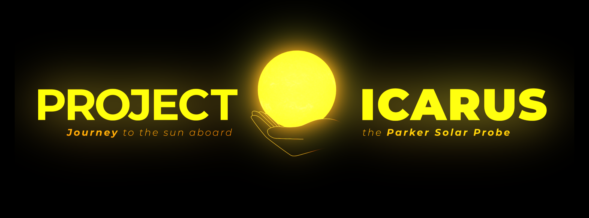

<!-- Improved compatibility of back to top link: See: https://github.com/othneildrew/Best-README-Template/pull/73 -->

<!--
*** Thanks for checking out the Best-README-Template. If you have a suggestion
*** that would make this better, please fork the repo and create a pull request
*** or simply open an issue with the tag "enhancement".
*** Don't forget to give the project a star!
*** Thanks again! Now go create something AMAZING! :D
-->

<!-- PROJECT SHIELDS -->
<!--
*** I'm using markdown "reference style" links for readability.
*** Reference links are enclosed in brackets [ ] instead of parentheses ( ).
*** See the bottom of this document for the declaration of the reference variables
*** for contributors-url, forks-url, etc. This is an optional, concise syntax you may use.
*** https://www.markdownguide.org/basic-syntax/#reference-style-links
-->
[![Contributors][contributors-shield]][contributors-url]
[![Forks][forks-shield]][forks-url]
[![Stargazers][stars-shield]][stars-url]
[![Issues][issues-shield]][issues-url]
[![MIT License][license-shield]][license-url]
[![LinkedIn][linkedin-shield]][linkedin-url]

<!-- PROJECT LOGO -->
 

  

  

     
    <a href="https://adamzhen.github.io/Project-Icarus-Official/" target="_blank">View Website</a>
    ·
    <a href="https://github.com/adamzhen/Project-Icarus-Official/issues">Report Bug</a>
    ·
    <a href="https://github.com/adamzhen/Project-Icarus-Official/issues">Request Feature</a>
     
     
    This interactive website was initially created for the 2022 NASA Space Apps Challenge (October 1-2). As a team of 2, <a href="https://github.com/WarrenWu4">Warren Wu<a> and I worked on a challenge called "<a href="https://2022.spaceappschallenge.org/challenges/2022-challenges/creative-data-display/details">Creative Data Display With the Parker Solar Probe</a>," but alas, our project was too ambitious to finish in 48 hours. So after the challenge ended, I decided to keep working on it on my own to steadily bring our original vision to fruition - that is, a vision of helping educate the public on the Parker Solar Probe's mission through an all-encompassing interactive, story-based experience packed with visuals. 
     
  

<!-- TABLE OF CONTENTS -->

  
<b>Table of Contents</b>

  <ol>
    <li>
      <a href="#about-the-project">About The Project</a>
      <ul>
        <li><a href="#built-with">Built With</a></li>
      </ul>
    </li>
    <li><a href="#contributing">Contributing</a></li>
    <li><a href="#license">License</a></li>
    <li><a href="#contact">Contact</a></li>
    <li><a href="#acknowledgments">Acknowledgments</a></li>
  </ol>

<!-- ABOUT THE PROJECT -->
## About The Project
UNDER CONSTRUCTION
<!-- Here's a blank template to get started: To avoid retyping too much info. Do a search and replace with your text editor for the following: `github_username`, `repo_name`, `twitter_handle`, `linkedin_username`, `email_client`, `email`, `project_title`, `project_description` -->

 

 (<a href="#readme-top">back to top</a>) 

### Built With

* ![JavaScript][JavaScript]
* ![HTML][HTML]
* ![CSS][CSS]
* ![Python][Python]
* ![Jupyter][Jupyter]
* [![PySPEDAS][PySPEDAS]][PySPEDAS-url]

(<a href="#readme-top">back to top</a>)

<!-- CONTRIBUTING -->
## Contributing

Contributions are what make the open source community such an amazing place to learn, inspire, and create. Any contributions you make are **greatly appreciated**.

If you have a suggestion that would make this better, please fork the repo and create a pull request. You can also simply open an issue with the tag "enhancement".
Don't forget to give the project a star! Thanks again!

1. Fork the Project
2. Create your Feature Branch (`git checkout -b feature/AmazingFeature`)
3. Commit your Changes (`git commit -m 'Add some AmazingFeature'`)
4. Push to the Branch (`git push origin feature/AmazingFeature`)
5. Open a Pull Request

(<a href="#readme-top">back to top</a>)

<!-- LICENSE -->
## License

Distributed under the MIT License. See `LICENSE.txt` for more information.

(<a href="#readme-top">back to top</a>)

<!-- CONTACT -->
## Contact

(<a href="#readme-top">back to top</a>)

<!-- ACKNOWLEDGMENTS -->
## Acknowledgments

* [Courtesy of NASA/SDO and the AIA, EVE, and HMI science teams.](https://sdo.gsfc.nasa.gov/data/)
* [Parker Solar Probe was designed, built, and is now operated by the Johns Hopkins Applied Physics Laboratory as part of NASA’s Living with a Star (LWS) program (contract NNN06AA01C). Support from the LWS management and technical team has played a critical role in the success of the Parker Solar Probe mission.](http://parkersolarprobe.jhuapl.edu/)
* [The Wide-Field Imager for Parker Solar Probe (WISPR) instrument was designed, built, and is now operated by the US Naval Research Laboratory in collaboration with Johns Hopkins University/Applied Physics Laboratory, California Institute of Technology/Jet Propulsion Laboratory, University of Gottingen, Germany, Centre Spatiale de Liege, Belgium and University of Toulouse/Research Institute in Astrophysics and Planetology.](https://wispr.nrl.navy.mil/wisprdata)
* [We acknowledge the NASA Parker Solar Probe Mission and the SWEAP team led by J. Kasper for use of data.](http://sweap.cfa.harvard.edu/Data.html)
* [README template by othneildrew](https://github.com/othneildrew/Best-README-Template/blob/master/BLANK_README.md)

(<a href="#readme-top">back to top</a>)

<!-- MARKDOWN LINKS & IMAGES -->
<!-- https://www.markdownguide.org/basic-syntax/#reference-style-links -->
[contributors-shield]: https://img.shields.io/github/contributors/adamzhen/Project-Icarus-Official.svg?style=for-the-badge
[contributors-url]: https://github.com/adamzhen/Project-Icarus-Official/graphs/contributors
[forks-shield]: https://img.shields.io/github/forks/adamzhen/Project-Icarus-Official.svg?style=for-the-badge
[forks-url]: https://github.com/adamzhen/Project-Icarus-Official/network/members
[stars-shield]: https://img.shields.io/github/stars/adamzhen/Project-Icarus-Official.svg?style=for-the-badge
[stars-url]: https://github.com/adamzhen/Project-Icarus-Official/stargazers
[issues-shield]: https://img.shields.io/github/issues/adamzhen/Project-Icarus-Official.svg?style=for-the-badge
[issues-url]: https://github.com/adamzhen/Project-Icarus-Official/issues
[license-shield]: https://img.shields.io/github/license/adamzhen/Project-Icarus-Official.svg?style=for-the-badge
[license-url]: https://github.com/adamzhen/Project-Icarus-Official/blob/master/LICENSE.txt
[linkedin-shield]: https://img.shields.io/badge/-LinkedIn-black.svg?style=for-the-badge&logo=linkedin&colorB=555
[linkedin-url]: https://linkedin.com/in/adam-zheng
[product-screenshot]: images/screenshot.png
[JavaScript]: https://img.shields.io/badge/JavaScript-323330?style=for-the-badge&logo=javascript&logoColor=F7DF1E
[HTML]: https://img.shields.io/badge/HTML5-E34F26?style=for-the-badge&logo=html5&logoColor=white
[CSS]: https://img.shields.io/badge/CSS3-1572B6?style=for-the-badge&logo=css3&logoColor=white
[Python]: https://img.shields.io/badge/Python-FFD43B?style=for-the-badge&logo=python&logoColor=blue
[Jupyter]: https://img.shields.io/badge/Jupyter-F37626.svg?&style=for-the-badge&logo=Jupyter&logoColor=white
[PySPEDAS]: https://img.shields.io/badge/PYSPEDAS-blue?style=for-the-badge&logo=python&logoColor=orange
[PySPEDAS-url]: https://pyspedas.readthedocs.io/en/latest/psp.html
