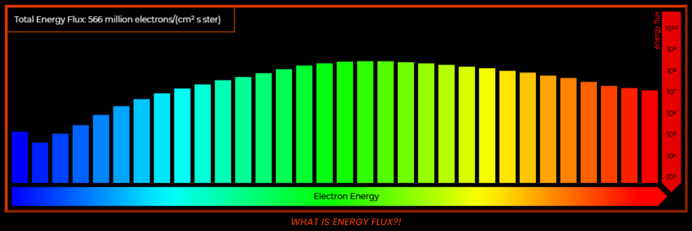

<!-- Improved compatibility of back to top link: See: https://github.com/othneildrew/Best-README-Template/pull/73 -->

<!--
*** Thanks for checking out the Best-README-Template. If you have a suggestion
*** that would make this better, please fork the repo and create a pull request
*** or simply open an issue with the tag "enhancement".
*** Don't forget to give the project a star!
*** Thanks again! Now go create something AMAZING! :D
-->
<!-- PROJECT SHIELDS -->
<!--
*** I'm using markdown "reference style" links for readability.
*** Reference links are enclosed in brackets [ ] instead of parentheses ( ).
*** See the bottom of this document for the declaration of the reference variables
*** for contributors-url, forks-url, etc. This is an optional, concise syntax you may use.
*** https://www.markdownguide.org/basic-syntax/#reference-style-links
-->

# Project Icarus
[![Contributors][contributors-shield]][contributors-url]
[![Forks][forks-shield]][forks-url]
[![Stargazers][stars-shield]][stars-url]
[![Issues][issues-shield]][issues-url]
[![MIT License][license-shield]][license-url]
[![LinkedIn][linkedin-shield]][linkedin-url]

<!-- PROJECT LOGO -->

  

   
  
  
  
   

<!-- TABLE OF CONTENTS -->

  
<b>Table of Contents</b>

  <ol>
    <li>
      <a href="#about-the-website">About The Website</a>
      <ul>
        <li><a href="#home">Home</a></li>
        <li><a href="#the-sun">The Sun</a></li>
        <li><a href="#the-psp">The PSP</a></li>
        <li><a href="#corona">Corona</a></li>
        <li><a href="#wispr">WISPR</a></li>
        <li><a href="#sweap">SWEAP</a></li>
        <li><a href="#isois">IS☉IS</a></li>
        <li><a href="#fields">FIELDS</a></li>
        <li><a href="#built-with">Built With</a></li>
      </ul>
    </li>
    <li><a href="#contributing">Contributing</a></li>
    <li><a href="#license">License</a></li>
    <li><a href="#contact">Contact</a></li>
    <li><a href="#acknowledgments">Acknowledgments</a></li>
  </ol>

<!-- ABOUT THE WEBSITE -->
# About The Website
This interactive website was initially created for the 2022 NASA Space Apps Challenge (October 1-2). As a team of 2, <a href="https://github.com/WarrenWu4">Warren Wu<a> and I worked on a challenge called "<a href="https://2022.spaceappschallenge.org/challenges/2022-challenges/creative-data-display/details">Creative Data Display With the Parker Solar Probe</a>," but alas, our project was too ambitious to finish in 48 hours. So after the challenge ended, I decided to keep working on it on my own to steadily bring our original vision to fruition - that is, a vision of helping educate the public on the Parker Solar Probe's mission through an all-encompassing, interactive experience packed with visuals.

The website is best viewed on larger, horizontal screens (computers, laptops, tablets, etc.). Currently, it does has some responsiveness for viewing on smaller, vertical screens (i.e. phones); however, the viewing experience there is not quite ideal. Future improvements could certainly include added responsiveness.

## [Home](https://adamzhen.github.io/Project-Icarus-Official/#home)
This section simply displays one of two logos that I designed - one is for larger, horizontal displays and the other for smaller, vertical displays.

(<a href="#readme-top">back to top</a>)

## [The Sun](https://adamzhen.github.io/Project-Icarus-Official/#thesun)
This section loads the most recent image of the sun from the SDO (Solar Dynamics Observatory) website's ["The Sun Now"](https://sdo.gsfc.nasa.gov/data/). These images are supposed to be updated every 15 minutes, though I have experienced some glitches where the images disappear or are formatted weirdly. The user can click on the image to cycle amongst images of different wavelengths.

(<a href="#readme-top">back to top</a>)

## [The PSP](https://adamzhen.github.io/Project-Icarus-Official/#thepsp)
This section uses a [3D model](https://solarsystem.nasa.gov/resources/2356/parker-solar-probe-3d-model/) loaded directly from NASA's website. When we first made the website, we actually downloaded the 3D model file and used Three.js to display it to our liking; however, it refused to work once uploaded onto GitHub, so I had to replace it.

(<a href="#readme-top">back to top</a>)

## [Corona](https://adamzhen.github.io/Project-Icarus-Official/#corona)
This section provides some preliminary context on the corona - the part of the sun that the Parker Solar Probe is intended to explore. It covers information on the corona itself, the Alfvén surface (or the outer boundary of the corona), and the solar weather events that arise from the corona. 

(<a href="#readme-top">back to top</a>)

## [WISPR](https://adamzhen.github.io/Project-Icarus-Official/#thewispr)
This section displays the images captured by the WISPR's inner & outer cameras for all 12 available orbits, along with a position display showing the PSP's position, it's distance from the sun (AU), and the date. Interactivity is integrated using the [wispr_display.js](https://github.com/adamzhen/Project-Icarus-Official/blob/main/wispr_display.js) file. Now, the slider acts as the main control point, representing the range of indices for the list of fits data that corresponds to the selected orbit. When you drag the slider, it finds the fits data (i.e. date, position, distance) at the index of the slider, updating the position display accordingly. It's a bit more complicated for the images, because not every fits data point corresponds with an inner/outer image. First, it searches the [PNG_match_lists](https://github.com/adamzhen/Project-Icarus-Official/tree/main/wispr_data/PNG_match_lists) for an inner and/or outer image date matching the fits date. If one is found, it uses the index of the image date to get the name of the image from [PNG_lists](https://github.com/adamzhen/Project-Icarus-Official/tree/main/wispr_data/PNG_lists), which is needed to load the image from the [WISPR website](https://wispr.nrl.navy.mil/data/rel/pngs/). Therefore, it should be noted that the images won't necessarily change every time you change the slider. And as for the play button, it simply automates dragging the slider at a specified speed (fps).

#### Images

  

The WISPR images displayed here are loaded from https://wispr.nrl.navy.mil/data/rel/pngs/ (I was unable to upload all of the images directly to the repository, as the file size was too large). As a result, the images can sometimes lag, and I have yet to find a workable solution other than enabling the user to lower/raise the frame rate as needed. 
Now, in order to obtain the [PNG_match_lists](https://github.com/adamzhen/Project-Icarus-Official/tree/main/wispr_data/PNG_match_lists) and [PNG_lists](https://github.com/adamzhen/Project-Icarus-Official/tree/main/wispr_data/PNG_lists) mentioned above, I first downloaded all of the PNGs. Then, I ran a python script  ([get_png_names.py](https://github.com/adamzhen/Project-Icarus-Official/blob/main/data_processing/get_png_names.py)) to compile all of the PNG names into [text files](https://github.com/adamzhen/Project-Icarus-Official/tree/main/wispr_data/PNG_lists) for each orbit & camera, which I copy & pasted into [wispr_display.js](https://github.com/adamzhen/Project-Icarus-Official/blob/main/wispr_display.js) (I know, very fancy). I used another python script ([exploring_fits_and_png_data.py](https://github.com/adamzhen/Project-Icarus-Official/blob/main/data_processing/exploring_fits_and_png_data.py)) to find the matching dates between the fits & png data, and export them into text files for each camera, which I copy & pasted into [wispr_display.js](https://github.com/adamzhen/Project-Icarus-Official/blob/main/wispr_display.js).

#### Position Display

  

In order to retrieve the date & position data, I first used [wget](https://www.gnu.org/software/wget/) to download the L3 fits data from https://wispr.nrl.navy.mil/data/rel/fits/L3/. Then, I ran a python script ([wispr_data.py](https://github.com/adamzhen/Project-Icarus-Official/blob/main/data_processing/wispr_data.py)) using [Astropy](https://www.astropy.org/) to extract the data I wanted, calculated the distances using the position data, and stored it all in [text files](https://github.com/adamzhen/Project-Icarus-Official/tree/main/wispr_data/wispr_txt_data) for each of the orbits. Then, I ran another python script ([read_wisprtext.py](https://github.com/adamzhen/Project-Icarus-Official/blob/main/data_processing/read_wisprtext.py)) to format all of the data into a gigantic 3D array which I then copy & pasted into my [wispr_display.js](https://github.com/adamzhen/Project-Icarus-Official/blob/main/wispr_display.js) file (later, when I was working on the SWEAP display, I realized that I could write the data directly into a JS file, so I did that for the SWEAP data, but did not feel the need to change it for the WISPR data). Finally, for the background images with the orbits, I used matplotlib to plot the PSP's position, and highlighted a different orbit for each image.

(<a href="#readme-top">back to top</a>)

## [SWEAP](https://adamzhen.github.io/Project-Icarus-Official/#thesweap)
This section visualizes data on the three most common particles in the solar wind - protons, electrons, and alphas - which are what SWEAP is measuring. There is a position display similar to the one in the WISPR section, but using data from SWEAP, which also includes the speed of the PSP. And finally, there are 3 units from which the user can pick: metric, imperial, and wacky (these will be explained further below). 

Interactivity is controlled by [sweap_display.js](https://github.com/adamzhen/Project-Icarus-Official/blob/main/sweap_display.js) (by the way, the slider/play button here work in essentially the same way as described above for WISPR), and all data analysis/extraction was done using pySPEDAS in [pyspedas_data_analysis.ipynb](https://github.com/adamzhen/Project-Icarus-Official/blob/main/pyspedas_data_analysis.ipynb), which contains more thorough documentation.

#### Controls & Position Display

  

The controls on the left allow the user to switch between protons, electrons, and alphas. Whenever you switch modes, it will try to keep the date & time the same as it was before, but if that's impossible, it will simply go to the start of the current orbit. This is done by taking the date/time before switching and checking if it's in the list of the dates for the new mode (...date_list.js files stored in [sweap_data](https://github.com/adamzhen/Project-Icarus-Official/tree/main/sweap_data) and generated using [read_sweaptext.py](https://github.com/adamzhen/Project-Icarus-Official/blob/main/data_processing/read_sweaptext.py)). The position display here uses data from the SPC dataset [spc_list.js](https://github.com/adamzhen/Project-Icarus-Official/blob/main/sweap_data/spc_list.js). It had to be different from the WISPR position display because for SWEAP, I was able to export one data point for every minute (for all data used in this section), which wouldn't have been compatible with the WISPR fits data. The reason the orbits look slightly different here is merely due to the usage of a different coordinate system. For the units here, I chose not to have the distance units (AU) change, so as to keep it consistent with the WISPR section. For speed, I converted it to KMPH for metric, MPH for imperial, and MACH NUMBER for wacky (speed of sound = 2.91545 km/s), which by the way, is supposed to wacky because sound cannot travel in the vacuum of space. 

#### Protons (SPC)

For SPC, I used pySPEDAS to download the cdf files from NASA's [website](https://spdf.gsfc.nasa.gov/pub/data/psp/sweap/spc/l3/l3i/), quickly extract data from them, and export the data (date/time, proton velocity, proton density, proton temperature, x & y coordinates, distance, and spacecraft velocity) into text files which were compiled into [spc_list.js](https://github.com/adamzhen/Project-Icarus-Official/blob/main/sweap_data/spc_list.js) using [read_sweaptext.py](https://github.com/adamzhen/Project-Icarus-Official/blob/main/data_processing/read_sweaptext.py). In the protons display, I visualized the data by (1) scaling the proton velocity according to the actual velocty (2) making the number of protons on screen at any time match the density in protons/cm^2 (3) changing the color of the protons based on the temperature. I also changed the radius of the sun in the center based on how far the PSP is from it (r = 32 / (distance in AU / 0.075)). Below are the different units that I used:
| Data Type     | Original  | Metric  | Imperial   | Wacky         |
| :-----------  | --------  | ------- | --------   | --------      |
| **Temperature** | K       | C       | F      | Death Valleys (1 death valley = 329.817 K) | 
| **Density**     | 1/cm^2  | 1/cm^2  | 1/in^2  | 1/penny (area of penny = 2.85 cm^2)        | 
| **Velocity**    | km/s    | kmph    | mph     | Mach Number (Mach 1 = 0.343 km/s) | 

  

#### Electrons (SPAN-e)

For SPAN-e, I used pySPEDAS to download the cdf files from NASA's [website](https://spdf.gsfc.nasa.gov/pub/data/psp/sweap/spe/l3/spe_sf0_pad/), quickly extract data from them, and export the data (date/time, differential energy flux for each of the 32 energy bins, and total electron density) into text files which were compiled into [spane_list.js](https://github.com/adamzhen/Project-Icarus-Official/blob/main/sweap_data/spane_list.js) using [read_sweaptext.py](https://github.com/adamzhen/Project-Icarus-Official/blob/main/data_processing/read_sweaptext.py). In the electrons display, I visualized the data for each of the 32 energy bins by plotting the energy flux on a logarithmic scale. I've also included a short blurb (with additional resources) to help the reader understand basically what energy flux represents here.
| Data Type               | Original        | Metric          | Imperial          | Wacky         |
| :-----------            | --------        | -------         | --------          | --------      |
| **Total Energy Flux**   | 1/cm^2-s-ster    | 1/cm^2-s-ster  | 1/in^2-s-ster     | 1/eardrum-s-ster (area of eardrum = 1.555 cm^2) | 
 

  

#### Alphas (SPAN-i)

For SPAN-i, I used pySPEDAS to download the cdf files from NASA's [website](https://spdf.gsfc.nasa.gov/pub/data/psp/sweap/spi/l3/spi_sf0a_mom_inst/), quickly extract data from them, and export the data (date/time, proton velocity, proton density, proton temperature) into text files which were compiled into [spani_list.js](https://github.com/adamzhen/Project-Icarus-Official/blob/main/sweap_data/spani_list.js) using [read_sweaptext.py](https://github.com/adamzhen/Project-Icarus-Official/blob/main/data_processing/read_sweaptext.py). I also discovered that data is, as of now, only available for orbits 2-8, so I only have those on the website. In the alphas display, I visualized the data by (1) scaling the alpha velocity according to the actual velocty (2) making the number of alphas on screen at any time match the density in alphas/cm^2 (3) changing the color of the alphas based on the temperature. Overall, very similar to the protons display, but here the display shows that the instrument is pointed to the side, not directly at the sun. Below are the different units that I used:
| Data Type     | Original  | Metric  | Imperial   | Wacky         |
| :-----------  | --------  | ------- | --------   | --------      |
| **Temperature** | K       | C       | F       | Death Valleys (1 death valley = 329.817 K) | 
| **Density**     | 1/cm^3  | 1/cm^3  | 1/in^3  | 1/acorn (volume of acorn = 2.5 cm^3)        | 
| **Velocity**    | km/s    | kmph    | mph     | Mach Number (Mach 1 = 0.343 km/s) | 

  

(<a href="#readme-top">back to top</a>)

## [ISOIS](https://adamzhen.github.io/Project-Icarus-Official/#theisois)
⚠️ SECTION UNDER CONSTRUCTION ⚠️

(<a href="#readme-top">back to top</a>)

  
## [FIELDS](https://adamzhen.github.io/Project-Icarus-Official/#thefields)
This section visualizes magnetic and electric field data from the FIELDS instrument. Similarly to the SWEAP display, this section contains a controls box, a position display (which runs using the same data as SWEAP), a play button, and a canvas display for data visualization. 

Interactivity is controlled by [fields_display.js](https://github.com/adamzhen/Project-Icarus-Official/blob/main/fields_display.js), and all data analysis/extraction was done using pySPEDAS in [pyspedas_data_analysis.ipynb](https://github.com/adamzhen/Project-Icarus-Official/blob/main/pyspedas_data_analysis.ipynb), which contains more thorough documentation on that matter.

#### Controls & Position Display

  

These displays are almost identical to those of SWEAP. The controls on the left allow the user to switch between magnetic and electric field. Whenever you switch modes, it should keep the date & time the same as it was before, as the two datasets encompass the same timeframes. The position display here uses data from the SPC dataset [spc_list.js](https://github.com/adamzhen/Project-Icarus-Official/blob/main/sweap_data/spc_list.js). By exporting one FIELDS data point for each minute, I was able to make it easily compatible with the position and velocity data from SPC. All that had to be done is take the date/time from the FIELDS data and check if it's in the [spcdate_list.js](https://github.com/adamzhen/Project-Icarus-Official/blob/main/sweap_data/spcdate_list.js), generated using [read_sweaptext.py](https://github.com/adamzhen/Project-Icarus-Official/blob/main/data_processing/read_sweaptext.py). For the units here, I chose not to have the distance units (AU) change, so as to keep it consistent with the WISPR section. For speed, I converted it to KMPH for metric, MPH for imperial, and MACH NUMBER for wacky (speed of sound = 2.91545 km/s), which by the way, is supposed to wacky because sound cannot travel in the vacuum of space. 

#### Magnetic Field

For magnetic field data, I used pySPEDAS to download the cdf files from NASA's [website](https://spdf.gsfc.nasa.gov/pub/data/psp/fields/l2/mag_rtn/) (datatype = mag_rtn), extract the data from them, and export it (magnetic field components (nT) in the RTN coordinate system) into text files which were then compiled as [fields_list.js](https://github.com/adamzhen/Project-Icarus-Official/blob/main/fields_data/fields_list.js) using [read_fieldstext.py](https://github.com/adamzhen/Project-Icarus-Official/blob/main/data_processing/read_fieldstext.py). I visualized this data by (1) scaling vector magnitudes logarithmically (base 2) to encompass the range of data [-554.0 nT, 786.6 nT] (2) splitting the display into a 3D view, a 2D side view, and a 2D top view (3) drawing axes to represent the RTN coordinates system, with bolded axes signifying positive values and the sun as a reference point (4) plotting the magnetic field's RTN components on the axes and labeling their values in nT. I also calculated the magnitude of the total magnetic field and displayed it in the bottom left.  

  

(<a href="#readme-top">back to top</a>)

## Built With
![JavaScript][JavaScript]
![HTML][HTML]
![CSS][CSS]
![Python][Python]
![Jupyter][Jupyter]
[![PySPEDAS][PySPEDAS]][PySPEDAS-url]
[![AstroPy][ASTROPY]](http://www.astropy.org/)

(<a href="#readme-top">back to top</a>)

<!-- CONTRIBUTING -->
## Contributing

Contributions are what make the open source community such an amazing place to learn, inspire, and create. Any contributions you make are **greatly appreciated**.

If you have a suggestion that would make this better, please fork the repo and create a pull request. You can also simply open an issue with the tag "enhancement".
Don't forget to give the project a star! Thanks again!

1. Fork the Project
2. Create your Feature Branch (`git checkout -b feature/AmazingFeature`)
3. Commit your Changes (`git commit -m 'Add some AmazingFeature'`)
4. Push to the Branch (`git push origin feature/AmazingFeature`)
5. Open a Pull Request

(<a href="#readme-top">back to top</a>)

<!-- LICENSE -->
## License

Distributed under the MIT License. See `LICENSE.txt` for more information.

(<a href="#readme-top">back to top</a>)

<!-- CONTACT -->
## Contact

(<a href="#readme-top">back to top</a>)

<!-- ACKNOWLEDGMENTS -->
## Acknowledgments

* [Courtesy of NASA/SDO and the AIA, EVE, and HMI science teams.](https://sdo.gsfc.nasa.gov/data/)
* [Parker Solar Probe was designed, built, and is now operated by the Johns Hopkins Applied Physics Laboratory as part of NASA’s Living with a Star (LWS) program (contract NNN06AA01C). Support from the LWS management and technical team has played a critical role in the success of the Parker Solar Probe mission.](http://parkersolarprobe.jhuapl.edu/)
* [The Wide-Field Imager for Parker Solar Probe (WISPR) instrument was designed, built, and is now operated by the US Naval Research Laboratory in collaboration with Johns Hopkins University/Applied Physics Laboratory, California Institute of Technology/Jet Propulsion Laboratory, University of Gottingen, Germany, Centre Spatiale de Liege, Belgium and University of Toulouse/Research Institute in Astrophysics and Planetology.](https://wispr.nrl.navy.mil/wisprdata)
* [We acknowledge the NASA Parker Solar Probe Mission and the SWEAP team led by J. Kasper for use of data.](http://sweap.cfa.harvard.edu/Data.html)
* [The FIELDS experiment on the Parker Solar Probe spacecraft was designed and developed under NASA contract NNN06AA01C.](https://fields.ssl.berkeley.edu/data/)
* [README template by othneildrew](https://github.com/othneildrew/Best-README-Template/blob/master/BLANK_README.md)

(<a href="#readme-top">back to top</a>)

<!-- MARKDOWN LINKS & IMAGES -->
<!-- https://www.markdownguide.org/basic-syntax/#reference-style-links -->
[contributors-shield]: https://img.shields.io/github/contributors/adamzhen/Project-Icarus-Official.svg?style=for-the-badge
[contributors-url]: https://github.com/adamzhen/Project-Icarus-Official/graphs/contributors
[forks-shield]: https://img.shields.io/github/forks/adamzhen/Project-Icarus-Official.svg?style=for-the-badge
[forks-url]: https://github.com/adamzhen/Project-Icarus-Official/network/members
[stars-shield]: https://img.shields.io/github/stars/adamzhen/Project-Icarus-Official.svg?style=for-the-badge
[stars-url]: https://github.com/adamzhen/Project-Icarus-Official/stargazers
[issues-shield]: https://img.shields.io/github/issues/adamzhen/Project-Icarus-Official.svg?style=for-the-badge
[issues-url]: https://github.com/adamzhen/Project-Icarus-Official/issues
[license-shield]: https://img.shields.io/github/license/adamzhen/Project-Icarus-Official.svg?style=for-the-badge
[license-url]: https://github.com/adamzhen/Project-Icarus-Official/blob/master/LICENSE.txt
[linkedin-shield]: https://img.shields.io/badge/-LinkedIn-black.svg?style=for-the-badge&logo=linkedin&colorB=555
[linkedin-url]: https://linkedin.com/in/adam-zheng
[product-screenshot]: images/screenshot.png
[JavaScript]: https://img.shields.io/badge/JavaScript-323330?style=for-the-badge&logo=javascript&logoColor=F7DF1E
[HTML]: https://img.shields.io/badge/HTML5-E34F26?style=for-the-badge&logo=html5&logoColor=white
[CSS]: https://img.shields.io/badge/CSS3-1572B6?style=for-the-badge&logo=css3&logoColor=white
[Python]: https://img.shields.io/badge/Python-FFD43B?style=for-the-badge&logo=python&logoColor=blue
[Jupyter]: https://img.shields.io/badge/Jupyter-F37626.svg?&style=for-the-badge&logo=Jupyter&logoColor=white
[PySPEDAS]: https://img.shields.io/badge/PYSPEDAS-blue?style=for-the-badge&logo=python&logoColor=orange
[PySPEDAS-url]: https://pyspedas.readthedocs.io/en/latest/psp.html
[ASTROPY]: http://img.shields.io/badge/AstroPy-orange.svg?style=for-the-badge&logo=python&logoColor=blue
